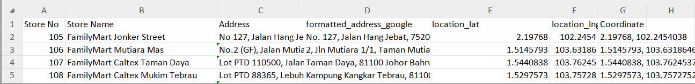
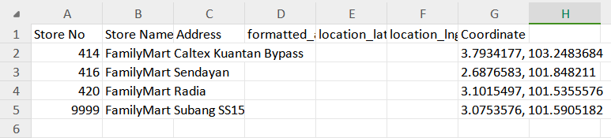

# QL-WebScraping
This codes are able to scrap data from website, mainly for property site using Beautiful Soup, along with cloudscraper as tool to bypass cloudflare.

On top on scraping, it also can filter out data in respect of the displacement between the scraped listing's address and the given list's address.

The tool used to extract the longitude/latitude is *www.geoapify.com*.

Cheat Sheets:

```
Specify output file
** Specify in config.ini

eg:
output_file_propertyguru = output/Result_Propertyguru_all.xlsx
output_file_edgeprop = output/Result_Edgeprop_all.xlsx
output_file_iproperty = output/Result_Iproperty_all_3560.xlsx

Specify filter file (location file)
** Specify in config.ini

eg:
filter_file_propertyguru = filter/filter_propertyguru.txt
filter_file_edgeprop = filter/filter_edgeprop.txt
filter_file_iproperty = filter/filter_iproperty.txt
```

```
1. pip install -r requirements.txt - Install all the necesssary packages
2. python main.py - Runs propertyguru by default
3. python main.py -s "propertyguru" - Runs propertyguru
4. python main.py -s "edgeprop" - Runs edgeprop
5. python main.py -s "iproperty" - Run iproperty
6. python main.py -s "propertyguru" -a "yes" - Allow statistical analysis page at the end (therefore output is always .xlsx)
7. python analysis.py -f {output_file}.xlsx - Do statistical analysis afterwards with provided output file
8. python main.py -s "edgeprop" -o 2 - By default its 1, to get the 2nd column from location file. 2 means getting 3rd column, which will be the postcode from address. The file is specify in config.ini 
```

Depending on the websites, each website have different key-value pair to be included before start scrapping.

Some of the important input requirements for each websites that are taken care in this scripts are as followed:
1. Propertyguru
      a. Search input: {freetext=(search input)} eg: freetext=Subang<br>
      b. Listing type: {listing_type=(buy / rent)} eg: listing_type=rent<br>
      c. Market type: {market=(residential / commercial)} eg: market=commercial<br>
      d. Property type: {property_type_code[]=(shop / office)} eg: property_type_code[]=RTLSP<br>
2. iProperty
      a. q - search input<br>
      b. {base_url}/ - sales(buy), rent(rent), etc...<br>
      c. {base_url}/{b.}/ - retail-space / shop-office, etc...<br>
3. Edgeprop
      a. keyword - search input<br>
      b. {base_url}/ - sales(buy), rent(rent), etc...<br>
      c. {base_url}/{b.}/ - retail-space / shop-office, etc...<br>

All of them is specified in the filter/ files. 
Example of filter/filter_propertyguru.txt
```
LOCATION FILE
sheets/FM_remain_propertyguru.csv

LISTING
rent

PROPERTY
SHOP
SHOPO
RTLSP
```

Description:
1. LOCATION FILE - File that stores the list of search input that wish to search (must follow the column format to work correctly)
2. LISTING - Listing type value as shown at above (eg: rent)
3. PROPERTY - Property type value that is used in PropertyGuru (eg: RTLSP)
4. PROPERTY SEPARATED - Property type value that is used in iProperty and EdgeProp (eg: shop / retail-space)


1. Install the package from the requirements.txt

```
pip install -r requirements.txt
```

2. Run the scripts.

By default, when this code is run without any arguments, the default arguements will looked like this:

      Namespace(site='propertyguru', config='config.ini', market='COMMERCIAL', analysis='no', option=1)

```
python main.py
```

That means when "python main.py" is given, the script will run as followed:
1. Site = "propertyguru" --> This runs the "propertyguru" codes
2. Config = "config.ini" --> This follows the setting on config.ini file
3. Market = "COMMERCIAL" --> This make the link finds only commercial listing
4. Analysis = "no" --> This tells the script to not generate the analysis sheets
5. Option = 1 --> This tells the script to input search using 2nd column of the given search location file. 


Note: The website to scrap can be chosen, so far the script supported 3 website, which are - 
1. PropertyGuru - "propertyguru"
2. EdgeProp - "edgeprop"
3. iProperty - "iproperty"

As this scripts will scrape data based on the given location, therefore the location need to be specified. 

```
(Store No	Store Name	Address	formatted_address_google	location_lat	location_lng	Coordinate)
```


However, only 3 of them are important: Store No, Store Name and Coordinate, meaning the script will still works with these given 3 data.



sheets/FM_remain.csv is an example of the search location file.
sheets/ExampleSheets.csv is an example of location file with necessary information

**The file needs to be in .csv**


To scrap the website, mention it when running the script.

```
python main.py -s "edgeprop"
```

To enable auto generation of statistic analysis, add the -a argument.

```
python main.py -s "propertyguru" -a "yes"
```
Alternatively, the analysis can be run separately from the main script.
```
python analysis.py -f {output_file}.xlsx
```
Note that the file should be in .xlsx extension.

** For changing the setting such as the destination file, etc. can refer to the **config.ini** file

--------------------------------- Extra Information ---------------------------------

To scrape a new website, the following steps should be followed:

1. Add **filter_{site}.txt** in filter/ directory.

In the txt file, include the locations in which the nearby rental information is wishes to find out, and the filters dedicated to the website accordingly (e.g. LOCATION FILE, LISTING, PROPERTY)<br>

2. Update **config.ini** 

Things to update: filter_file_{site}, output_file_{site}, base_url_{site}<br>

3. Update **content.py**

Add new method to connect the new website url and make sure it can get the HTML content from the website.<br>
If the website is static, BeautifulSoup alone is needed.<br>
However most website are dynamic nowadats, therefore Selenium is requried as it have a function of wait until the web page loaded before extract the HTML content.<br>

4. On main, add more conditions for the newly added website.

a. Specify the location of Database<br>
b. Specify the location of RentalURL<br>
c. Initialize Workbook instance (add header) - For convienience purposes, as the website scraped usually have 3 main data - Price, Size, psf, therefore it is recommend to assign them in 4th, 5th and 6th position. (1, 2, 3, 4, 5, 6,...). To change the position, the position should be also change in the 'analysis.py' file.<br>
d. Initialize WebScraping instance - Provide base url, site name, database, workbook, rentalurl, whether to perform analysis, and filter file<br>
e. Add ***web_scraping_{site}*** and ***iterate_page_{site}*** methods in main. Modify related object into the current website. Some important thing to modify are the tag for identifying last page, and tag to get the next page link.<br>

5. Modify created rental_url_{site}.py

Every website have different query parameters, therefore a new rental_url.py need to be created to handle each of the website.<br>
In the new **rental_url_{site}.py**, modify the url by changing the query parameter accordingly so that the output url is workable.<br>

6. Modify created database_{site}.py

Based on the web content, modify the tags accordingly and test it until they work accordingly.<br>

7. Add method for the site in workbook.py

Lastly, the destination on place to store data need to modify as well, as the column of the shees would varies between website and perferences. <br>

--------------------------------------------------------------------------------------------------------------------------------

All result can be calculated and a file can be generated through **combine_file.py** 
```
python combine_file.py -l "output/Result_Edgeprop.xlsx" "output/Result_Iproperty.xlsx" "output/Result_Propertyguru.xlsx" -o "out.xlsx"
```

Where -l stores a list of file to be combine.
      -o specific an output file

The output is a .xlsx file with combined listings based on given location along with a summary 